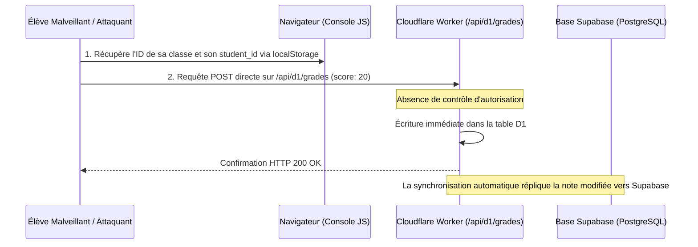
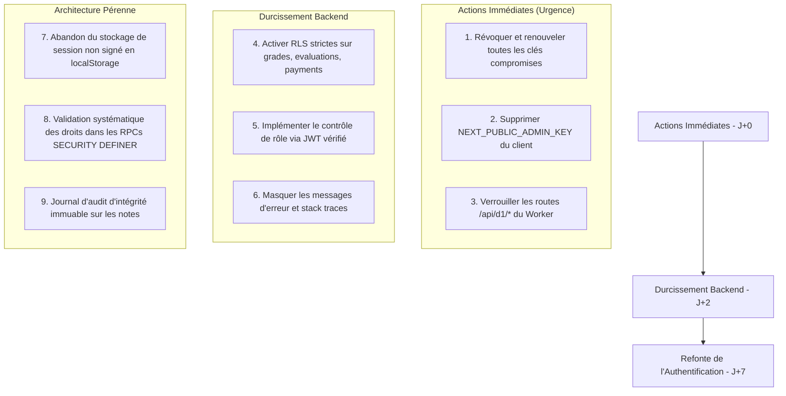

# 🛡️ RAPPORT D'AUDIT COMPLET & MODÉLISATION DES VECTEURS D'ATTAQUE
**Application** : CampusFlow (gotam.fun)  
**Objet** : Diagnostic de sécurité exhaustif, cartographie des vulnérabilités et modélisation théorique des attaques externes.  
**Objectif** : Servir de cahier des charges technique pour la remédiation et le durcissement complet du système.

---

## 📑 TABLE DES MATIÈRES
1. [Synthèse Globale & Matrice des Vulnérabilités](#1-synthèse-globale--matrice-des-vulnérabilités)
2. [Perspective Black-Box : Comment un Attaquant Découvre les Failles de l'Extérieur](#2-perspective-black-box--comment-un-attaquant-découvre-les-failles-de-lextérieur)
3. [Modélisation des 6 Vecteurs d'Attaque Critiques](#3-modélisation-des-6-vecteurs-dattaque-critiques)
   - 3.1. Manipulation Arbitraire des Notes & Évaluations
   - 3.2. Compromission & Prise de Contrôle des Comptes Élèves / Professeurs
   - 3.3. Neutralisation & Détournement du Compte Directeur / Admin
   - 3.4. Falsification des Données Financières & Fraude aux Frais de Scolarité
   - 3.5. Fuite Anticipée des Sujets d'Examen & Corrigés
   - 3.6. Altération & Suppression des Ressources Cloudflare R2
4. [Comparatif des Méthodologies d'Attaque : Expert Senior vs Attaque Assistée par IA](#4-comparatif-des-méthodologies-dattaque--expert-senior-vs-attaque-assistée-par-ia)
5. [Plan Directeur de Remédiation & Durcissement (Cahier des Charges Correctif)](#5-plan-directeur-de-remédiation--durcissement-cahier-des-charges-correctif)

---

## 1. SYNTHÈSE GLOBALE & MATRICE DES VULNÉRABILITÉS

L'application repose sur une architecture SPA (Single Page Application Next.js en mode `export`) connectée à **Supabase** (PostgreSQL / PostgREST) et à un **Cloudflare Worker** (passerelle API D1 / R2 / notifications).

### Cartographie des Failles Fondamentales
| ID | Désignation | Gravité | Cause Racine |
|---|---|---|---|
| **V-01** | Endpoints Cloudflare D1 non authentifiés | 🔴 Critique | Absence de middleware de validation de token/clé sur `/api/d1/*` |
| **V-02** | Politiques RLS Supabase permissives (`USING (true)`) | 🔴 Critique | Règles de base de données autorisant toute écriture anonyme |
| **V-03** | Rôle et autorisations validés uniquement côté client | 🔴 Critique | État d'authentification basé sur `localStorage` sans validation cryptographique serveur |
| **V-04** | Exposition de secrets dans les variables d'environnement publiques | 🔴 Critique | Préfixe `NEXT_PUBLIC_` et fallbacks hardcodés (`ADMIN_KEY`) |
| **V-05** | IDOR sur la saisie et modification des notes | 🟠 Haute | Absence de vérification du lien enseignant-matière-classe lors des mutations |
| **V-06** | Absence de rate-limiting sur les points d'entrée sensibles | 🟠 Haute | Absence de limitation de débit sur `/api/inscription` et les routes d'authentification |

---

## 2. PERSPECTIVE BLACK-BOX : COMMENT UN ATTAQUANT DÉCOUVRE LES FAILLES DE L'EXTÉRIEUR

Même **sans aucun accès préalable au code source**, un attaquant externe analyse l'application via des techniques classiques d'ingénierie inverse web :

```
                                  FLUX DE DÉCOUVERTE EXTERNE (BLACK-BOX)
                                  
  [ Navigateur Web ] ──(F12 Sources / Bundles JS)──> Extraction des variables NEXT_PUBLIC_*
          │                                           (Supabase URL, Anon Key, Worker URL, Admin Key)
          │
          ├──(Inspection Réseau / DevTools)─────────> Interception des requêtes RPC Supabase
          │                                           et des appels Worker (/api/d1/*, /notify)
          │
          └──(Console JS / Postman / curl)──────────> Test direct des endpoints d'API découverts
                                                      (Énumération des tables PostgREST et D1)
```

1. **Extraction des artefacts compilés (`.js` chunks)** :  
   Dans une application Next.js statique, tous les fichiers JS du répertoire `/_next/static/chunks/` sont publics. Une simple recherche textuelle (`grep` ou regex dans les DevTools) sur des mots-clés tels que `supabase.co`, `workers.dev`, `ADMIN_KEY` ou `api/d1` révèle la topologie complète de l'infrastructure.
2. **Écoute passive du trafic réseau** :  
   Lors de la navigation standard d'un compte étudiant, l'application émet des requêtes vers Supabase et vers le Worker. L'attaquant observe la structure des payloads JSON, les noms de tables (`grades`, `student_profiles`, `school_payments`) et les endpoints d'écriture.
3. **Cartographie des contrôles d'accès** :  
   L'attaquant constate que les requêtes d'écriture ne transmettent pas de jeton JWT signé par un serveur d'authentification centralisé, mais s'exécutent avec le rôle anonyme PostgREST ou sans en-tête d'authentification sur le Worker.

---

## 3. MODÉLISATION DES 6 VECTEURS D'ATTAQUE CRITIQUES

---

### 3.1. MANIPULATION ARBITRAIRE DES NOTES & ÉVALUATIONS
* **Gravité** : 🔴 Maximum  
* **Impact** : Falsification complète des relevés de notes, bulletins scolaires et moyennes générales.



* **Mécanique de la vulnérabilité** :
  1. La table `grades` accepte des insertions/mises à jour directes par clé primaire composite (`evaluation_id`, `student_id`).
  2. L'absence d'authentification sur `/api/d1/grades` permet d'injecter ou d'écraser n'importe quelle entrée.
  3. Parallèlement, côté Supabase, si la politique RLS n'est pas restreinte à l'identité cryptographique de l'enseignant responsable (`auth.uid()`), l'opération PostgREST réussit également via la clé publique anonyme.

---

### 3.2. COMPROMISSION & PRISE DE CONTRÔLE DES COMPTES ÉLÈVES / PROFESSEURS
* **Gravité** : 🔴 Maximum  
* **Impact** : Usurpation d'identité, accès aux données personnelles (RGPD), verrouillage des utilisateurs légitimes.

* **Mécanique de la vulnérabilité** :
  1. **Énumération des identifiants** : La table `student_profiles` et `teacher_profiles` est interrogeable via l'API D1 (`GET /api/d1/student_profiles`), exposant la liste complète des `access_code`, `matricule`, noms et prénoms.
  2. **Réinitialisation du secret d'accès (Account Takeover)** :
     - Les profils utilisent deux champs d'état : `pin_set` (booléen) et `pin_code` (code PIN).
     - Une requête de mise à jour non filtrée permet de modifier un profil cible en configurant `pin_set = false` et `pin_code = null`.
     - Lors de la tentative de connexion suivante avec le matricule ou code d'accès de la victime, le flux d'accueil considère le compte comme vierge et bascule sur l'interface `pin_create`.
     - L'attaquant définit son propre PIN à 4 chiffres et prend le contrôle exclusif du profil.

---

### 3.3. NEUTRALISATION & DÉTOURNEMENT DU COMPTE DIRECTEUR / ADMIN
* **Gravité** : 🔴 Maximum  
* **Impact** : Prise de contrôle de l'ensemble de l'établissement scolaire, modification des paramètres de l'organisation.

* **Mécanique de la vulnérabilité** :
  1. **Écrasement du PIN d'administration** : L'accès aux fonctionnalités d'administration de l'établissement repose sur la vérification d'un `security_pin` stocké sur la table `organizations`.
  2. En ciblant la ressource de l'organisation (`POST /api/d1/organizations`), un attaquant peut modifier la valeur de `security_pin` sans connaître l'ancienne valeur.
  3. **Escalade de privilèges d'interface** : Dans le client web, la variable de session `role` stockée en clair dans le stockage local du navigateur (`localStorage`) gouverne l'affichage conditionnel des routes. En modifiant simplement cette valeur vers `director` ou `superadmin`, l'attaquant déverrouille les écrans d'administration et soumet des commandes directes.

---

### 3.4. FALSIFICATION DES DONNÉES FINANCIÈRES & FRAUDE AUX FRAIS DE SCOLARITÉ
* **Gravité** : 🔴 Critique  
* **Impact** : Perte financière directe pour l'établissement, délivrance illégitime de certificats de scolarité en règle.

* **Mécanique de la vulnérabilité** :
  1. Les paiements de scolarité sont enregistrés dans la table `school_payments` (`id`, `student_id`, `amount`, `payment_method`, `status`, `organization_id`).
  2. Sans vérification d'intégrité côté serveur (webhooks bancaires signés ou validation par rôle comptable strict), une écriture directe dans cette table permet d'insérer des transactions fictives marquées comme validées.
  3. L'application calcule le solde restant d'un élève en sommant les entrées de cette table. L'insertion d'une ligne de paiement factice ramène le solde à zéro, validant automatiquement les dossiers bloqués pour impayés.

---

### 3.5. FUITE ANTICIPÉE DES SUJETS D'EXAMEN & CORRIGÉS
* **Gravité** : 🔴 Critique  
* **Impact** : Perte de validité des évaluations et examens, rupture d'équité académique.

* **Mécanique de la vulnérabilité** :
  1. Les tables `exam_papers`, `exercises` et `subject_programs` stockent les définitions des épreuves, incluant parfois les champs `questions` (JSONB) et `answer_key` (corrigés types).
  2. La lecture ouverte via les requêtes D1 (`GET /api/d1/exam_papers`) ou via les politiques Supabase permissives permet à n'importe quel compte étudiant d'extraire les sujets et leurs grilles d'évaluation avant la date officielle de passage.

---

### 3.6. ALTÉRATION & SUPPRESSION DES RESSOURCES CLOUDFLARE R2
* **Gravité** : 🟠 Élevé  
* **Impact** : Perte irréversible de supports de cours, défiguration de documents officiels (bulletins PDF, reçus, tampons d'école).

* **Mécanique de la vulnérabilité** :
  1. Les routes de gestion des fichiers du Worker (`/api/r2/upload`, `/api/r2/delete`, `/api/r2/list`) vérifient la présence d'une clé d'administration (`ADMIN_KEY`).
  2. Cette même clé étant distribuée dans le code JavaScript public du client (`NEXT_PUBLIC_ADMIN_KEY`), elle perd sa qualité de secret.
  3. Tout utilisateur peut transmettre cet en-tête pour purger le compartiment R2 (`LIBRARY_BUCKET`) ou remplacer des fichiers existants par des versions corrompues.

---

## 4. COMPARATIF DES MÉTHODOLOGIES D'ATTAQUE : EXPERT SENIOR VS ATTAQUE ASSISTÉE PAR IA

```
                                  COMPARAISON DES APPROCHES
                                  
  [ Profil : Pentester Senior (30 ans d'expérience) ]      [ Profil : Attaque Automatisée par IA ]
  ──────────────────────────────────────────────────      ───────────────────────────────────────
  • Approche : Chirurgicale, furtive, contextuelle       • Approche : Analyse statique de masse, fuzzing
  • Cible : Logique métier, failles de cohérence         • Cible : Exhaustivité des endpoints, syntaxe brute
  • Mode opératoire :                                    • Mode opératoire :
    - Décompile les bundles pour comprendre le modèle     - Télécharge l'ensemble des fichiers .js du build
    - Cible uniquement sa note et celle d'un groupe       - Parse l'AST (Abstract Syntax Tree) pour extraire
    - Ajuste les moyennes de classe pour éviter           toutes les routes d'API, secrets et regex
      toute détection statistique (anomalie d'écart-type) - Génère automatiquement des matrices de requêtes
    - Maintient la persistance sans casser le service     sur les 95 tables du schéma D1
```

### Cas A : Le Pentester Senior (Approche Chirurgicale)
1. **Discrétion maximale** : L'attaquant n'attribue pas un 20/20 brutal qui déclencherait une alerte visuelle de l'enseignant. Il analyse la distribution statistique des notes de la classe et injecte une note cohérente (ex: 15.5/20).
2. **Couverture des traces** : Il consulte la structure des tables d'audit et s'assure qu'aucun déclencheur (trigger) ne journalise l'adresse IP ou que le champ `graded_by` contient un UUID d'enseignant valide existant dans la base.
3. **Maintien d'accès discret** : Il privilégie l'altération ciblée de la table `organizations` pour s'octroyer des privilèges sans impacter la disponibilité de la plateforme.

### Cas B : L'Attaque Assistée par IA (Approche Exhaustive & Rapide)
1. **Reconnaissance automatisée** : L'outil d'IA reçoit le code source minifié du frontend. Il extrait en quelques secondes l'ensemble des routes (`/api/d1/:table`, `/api/r2/*`, `/api/inscription`), les structures d'objets TypeScript et les clés exposées.
2. **Génération de charge multi-vectorielle** : L'IA formule automatiquement des scripts de test couvrant l'ensemble des 95 tables répertoriées dans la whitelist D1 pour cartographier précisément quelles tables acceptent des écritures directes.
3. **Exploitation en chaîne** : L'IA identifie instantanément les relations entre tables (clés étrangères) et orchestre les requêtes dans l'ordre exact requis pour créer un compte, l'inscrire, lui valider des paiements et lui attribuer les notes maximales.

---

## 5. PLAN DIRECTEUR DE REMÉDIATION & DURCISSEMENT (CAHIER DES CHARGES CORRECTIF)

Ce plan constitue la feuille de route technique pour corriger définitivement l'ensemble des vulnérabilités.



### Spécifications Techniques des Corrections

#### 1. Verrouillage du Cloudflare Worker (`notification-worker/src/index.ts`)
* **Exigence** : Les routes `/api/d1/*` et `/api/r2/*` ne doivent jamais être accessibles sans authentification forte.
* **Mesure** :
  - Exiger un jeton d'autorisation serveur ou une signature cryptographique pour chaque requête D1.
  - Supprimer tout fallback hardcodé (`|| 'cf-admin-k3y-campusflow-2026-s3cur3'`).
  - Sanctuariser les messages d'erreur : ne renvoyer aucun objet `stack` dans les réponses d'erreur HTTP 500 en production.

#### 2. Durcissement des Politiques PostgreSQL (Supabase RLS)
* **Exigence** : Aucune table critique ne doit posséder de politique `USING (true)` pour les opérations `INSERT`, `UPDATE` ou `DELETE`.
* **Règles RLS obligatoires pour `grades`** :
  ```sql
  ALTER TABLE public.grades ENABLE ROW LEVEL SECURITY;

  -- Seuls les enseignants assignés à la matière de l'évaluation peuvent modifier les notes
  CREATE POLICY "grades_teachers_modify" ON public.grades
      FOR ALL
      USING (
          EXISTS (
              SELECT 1 FROM public.evaluations e
              JOIN public.subjects s ON s.id = e.subject_id
              WHERE e.id = public.grades.evaluation_id
                AND s.teacher_id = auth.uid()
          )
      );

  -- Les élèves ne peuvent que consulter leurs propres notes
  CREATE POLICY "grades_students_view" ON public.grades
      FOR SELECT
      USING (student_id = auth.uid());
  ```

#### 3. Découplage Strict des Secrets et Variables d'Environnement
* **Exigence** : Séparation stricte entre variables publiques et clés secrètes.
* **Mesure** :
  - Supprimer `NEXT_PUBLIC_ADMIN_KEY` du fichier `.env.local` et du bundle Next.js.
  - S'assurer que `SUPABASE_SERVICE_ROLE_KEY` n'est manipulée qu'au sein d'environnements d'exécution sécurisés (Workers Cloudflare, Edge Functions privées).
  - Inclure `.env.local` dans le fichier `.gitignore` et révoquer les clés actuelles sur les consoles Supabase et Cloudflare.

#### 4. Intégrité des Sessions et Rôles Applicatifs
* **Exigence** : Le rôle utilisateur (`role`) ne doit plus être une donnée d'autorité stockée de manière modifiable dans le `localStorage` du navigateur.
* **Mesure** :
  - Chaque action critique (attribution de note, validation de paiement, suppression d'utilisateur) doit vérifier l'identité et les permissions réelles de l'appelant au niveau de la base de données via `auth.uid()` ou via une fonction RPC `SECURITY DEFINER` validant formellement le `session_token`.
