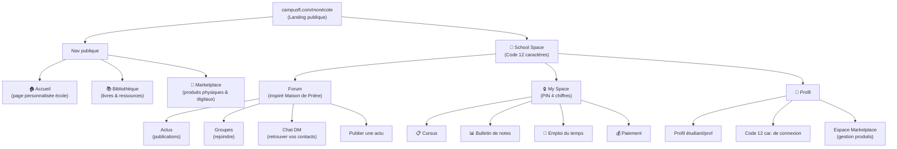

# 🎓 CampusFlow — Nouvelle Architecture d'Interface

## Vue d'ensemble

Refonte complète de l'interface de **CampusFlow** (`campusfl.com/monécole`) en s'inspirant du design holographique glassmorphism du projet **Maison de Prière App**.

> [!IMPORTANT]
> Ce plan conserve tout le backend Supabase existant (tables, RLS, RPC) et restructure uniquement le frontend.

---

## Architecture des pages



---

## Navigation

### Nav publique (Top bar + Bottom nav)
Visible par **tous sans connexion** :

| Onglet | Icône | Route |
|--------|-------|-------|
| Accueil | `Home` | `/{orgSlug}` (landing existante) |
| Bibliothèque | `BookMarked` | `/{orgSlug}/library` (existe déjà) |
| Marketplace | `ShoppingBag` | `/{orgSlug}/shop` (existe déjà) |
| **School Space** | `GraduationCap` | **Bouton spécial** → demande code 12 car. |

### Après connexion School Space (code 12 car.)
Bottom nav **interne** (style Maison de Prière) :

| Onglet | Icône | Description |
|--------|-------|-------------|
| Forum | `MessageSquare` | Actus, Groupes, Chat DM (inspiré community-view) |
| My Space | `Lock` | Cursus, Notes, Horaires, Paiements (nécessite PIN 4 chiffres) |
| Profil | `User` | Profil + espace marketplace vendeur |

---

## Plan d'implémentation par phases

### Phase 1 — Nouvelle page principale SPA `/{orgSlug}/campus`
**Fichier:** `src/app/[orgSlug]/campus/page.tsx`

La page principale post-connexion avec le code 12 caractères. C'est une **SPA avec tabs** (comme le `page.tsx` de Maison de Prière).

**Composants nécessaires :**
- `CampusBottomNav` — Bottom nav glassmorphism (3 onglets : Forum, My Space, Profil)
- Importation dynamique de chaque vue

```
src/app/[orgSlug]/campus/
  └── page.tsx          # SPA principale post-code-12
src/components/campus/
  ├── campus-bottom-nav.tsx
  ├── forum-view.tsx     # Actus + Groupes + Chat DM
  ├── myspace-view.tsx   # Cursus + Notes + EDT + Paiements (PIN requis)
  └── profile-view.tsx   # Profil + Marketplace vendeur
```

### Phase 2 — Refonte de la landing `/{orgSlug}/page.tsx`
Modifier la navbar pour inclure les 4 onglets publics :
- Accueil (scroll vers sections)
- Bibliothèque (lien vers `/{orgSlug}/library`)
- Marketplace (lien vers `/{orgSlug}/shop`)
- **School Space** (bouton qui mène vers `/{orgSlug}/login` → code 12 car. → redirige vers `/campus`)

### Phase 3 — Forum View (inspiré community-view.tsx de Maison de Prière)
**Fichier:** `src/components/campus/forum-view.tsx`

Architecture des sous-onglets (Tabs) :

| Sous-tab | Inspiration | Description |
|----------|-------------|-------------|
| **Actus** | `prayers` tab de Maison de Prière | Publications/actualités avec likes, commentaires, photos — Utilise `tutoring_requests` table ou nouvelle table `school_posts` |
| **Groupes** | Groupes de Maison de Prière | Rejoindre des groupes, discussions — Réutilise `chat_conversations` type='group' |
| **Chat DM** | Chat tab de Maison de Prière | Messages privés — Réutilise le système de messages existant |

**Boutons en tête (style Maison de Prière) :**
- "Retrouver vos contacts" (UserPlus) → mène aux DM
- "Rejoindre des groupes" (Users) → mène aux groupes
- "Publier une actu" (Plus) → dialogue de publication

### Phase 4 — My Space View (PIN requis)
**Fichier:** `src/components/campus/myspace-view.tsx`

Reprend les fonctionnalités du `student/dashboard` existant mais sous forme de sous-tabs :

| Sous-tab | Existant dans | Action |
|----------|---------------|--------|
| Cursus | `student/dashboard` (filière info) | Infos sur la filière, matières, progression |
| Bulletin de notes | `student/dashboard` tab grades | Relevé de notes avec moyennes |
| Emploi du temps | `student/dashboard` tab timetable | Grille hebdomadaire |
| Paiement | `student/dashboard` tab payments | Historique des paiements |

> [!WARNING]
> My Space demande le **PIN à 4 chiffres** à l'entrée (comme `pin_verify` dans login). Le PIN est vérifié via RPC `verify_pin`.

### Phase 5 — Profile View
**Fichier:** `src/components/campus/profile-view.tsx`

| Section | Description |
|---------|-------------|
| Infos profil | Nom, photo, matricule, classe, filière |
| Code de connexion | Affiche le code à 12 caractères |
| Espace Marketplace | Gestion et publication de produits (physiques et digitaux) dans la marketplace |
| Déconnexion | Clear localStorage session |

### Phase 6 — Modification du flux login
**Fichier existant:** `src/app/[orgSlug]/login/page.tsx`

Modifier `redirectToDashboard()` pour rediriger vers `/{orgSlug}/campus` au lieu de `/{orgSlug}/student/dashboard` ou `/{orgSlug}/prof/dashboard`.

---

## Fichiers à créer

| Fichier | Description |
|---------|-------------|
| `src/app/[orgSlug]/campus/page.tsx` | Page SPA principale |
| `src/components/campus/campus-bottom-nav.tsx` | Bottom nav 3 tabs |
| `src/components/campus/forum-view.tsx` | Forum (Actus, Groupes, DM) |
| `src/components/campus/myspace-view.tsx` | Espace perso (Notes, EDT, etc.) |
| `src/components/campus/profile-view.tsx` | Profil + Marketplace vendeur |

## Fichiers à modifier

| Fichier | Modification |
|---------|-------------|
| `src/app/[orgSlug]/page.tsx` | Navbar publique : Accueil, Bibliothèque, Marketplace, School Space |
| `src/app/[orgSlug]/login/page.tsx` | Redirect → `/campus` |
| `src/app/[orgSlug]/layout.tsx` | Aucun changement majeur |

## Tables Supabase existantes réutilisées

- `student_profiles` / `teacher_profiles` → Profils
- `chat_conversations` / `chat_messages` / `chat_participants` → Forum groupes + DM
- `evaluations` / `grades` → Bulletin de notes
- `timetable_slots` → Emploi du temps
- `school_payments` → Paiements
- `organizations` / `classrooms` / `filieres` → Info école

---

## Questions ouvertes

1. **Table `school_posts`** — Faut-il créer une nouvelle table pour les "Actus" du forum, ou réutiliser `tutoring_requests` (renommé conceptuellement) ?
2. **Marketplace vendeur** — Le `seller-dashboard.tsx` de Maison de Prière existe. Faut-il le porter tel quel ou l'adapter au contexte scolaire ?
3. **Rôle prof vs étudiant** — Le forum est-il identique pour les deux rôles ou y a-t-il des permissions différentes (ex: seuls les profs publient des actus) ?
